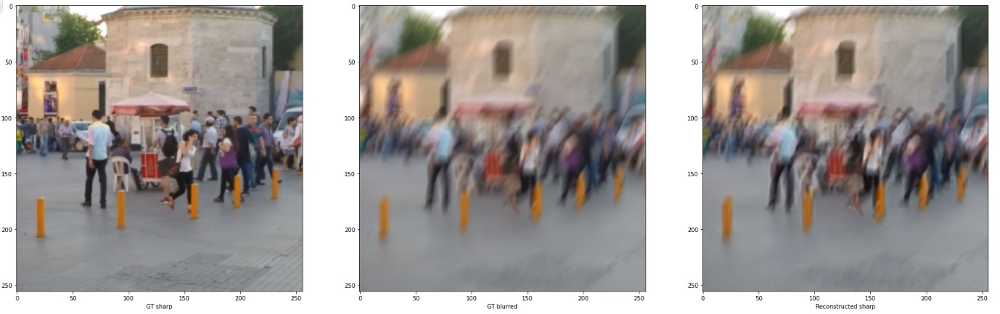

# DeblurGAN-v2: Deblurring (Orders-of-Magnitude) Faster and Better (https://arxiv.org/abs/1908.03826)

Orest Kupyn, Tetiana Martyniuk, Junru Wu, Zhangyang Wang

*ICCV 2019*

****
 

This folder provides a re-implementation of this paper in PyTorch, developed as part of the course METU CENG 796 - Deep Generative Models. The re-implementation is provided by:

*Duygu Arslan, arslan.duygu@metu.edu.tr

*Bedrettin Çetinkaya, bedrettin.cetinkaya@metu.edu.tr

Please see the jupyter notebook file [main.ipynb](main.ipynb) for a summary of paper, the implementation notes and our experimental results.