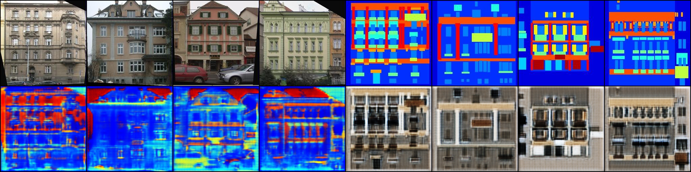

# [DualGAN: Unsupervised Dual Learning for Image-to-Image Translation](https://arxiv.org/pdf/1704.02510.pdf)

Zili Yi, Hao (Richard) Zhang, Ping Tan, and Minglun Gong

*ICCV 2017*

This folder provides a re-implementation of this paper in PyTorch, developed as part of the course METU CENG 796 - Deep Generative Models. The re-implementation is provided by:

* Emre Kulah, e188135@metu.edu.tr 

* Arif Gorkem Ozer, e188174@metu.edu.tr

Please see the jupyter notebook file [main.ipynb](main.ipynb) for a summary of paper, the implementation notes and our experimental results.

