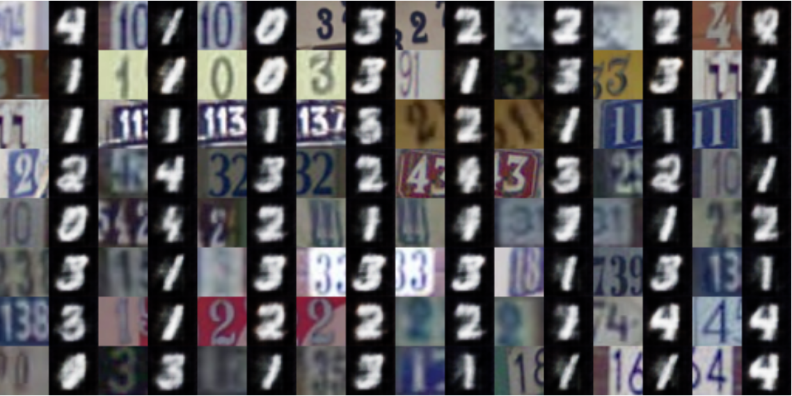

# Paper Title

Duplex Generative Adversarial Network for Unsupervised Domain Adaptation\
http://openaccess.thecvf.com/content_cvpr_2018/papers/Hu_Duplex_Generative_Adversarial_CVPR_2018_paper.pdf

Lanqing Hu, Meina Kan, Shiguang Shan, Xilin Chen\
CVPR 2018

This folder provides a re-implementation of this paper in PyTorch, developed as part of the course METU CENG 796 - Deep Generative Models. The re-implementation is provided by:

* Cansu Cemre Yeşilçimen, e203635 _at_ metu _dot_ edu _dot_ tr
* Cem Önem, e203182 _at_ metu _dot_ edu _dot_ tr

## Getting Started

In this version of our project, we provide pretrained models of encoder and generator. All hyperparameters are included in the main.ipynb file.
Datasets are downloaded via torchvision dataloaders automatically.
Final generated images are saved under gdruns/ directory, which is also visible in the notebook itself.
Final accuracy results are logged on the terminal in the notebook.

## Prerequisites
Before reviewing, download_data.sh script should be run, in order to download pretrained generator weights.
