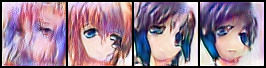

# [HistoGAN: Controlling Colors of GAN-Generated and Real Images via Color Histograms](https://arxiv.org/abs/2011.11731)

Mahmoud Afifi, Marcus A. Brubaker, Michael S. Brown

*CVPR 2021*

This folder provides a re-implementation of this paper in PyTorch, developed as part of the course METU CENG 796 - Deep Generative Models. The re-implementation is provided by:
* Özgür Aslan 2236958 aslan.ozgur@metu.edu.tr  
* Burak Bolat 2237097 burak.bolat@metu.edu.tr

Please see the jupyter notebook file [main.ipynb](main.ipynb) for a summary of paper, the implementation notes and our experimental results.

#### Installation
Please install 
- torch-optimizer for DiffGrad optimizer
- torchmetrics and torchmetrics[image] for FID score computation