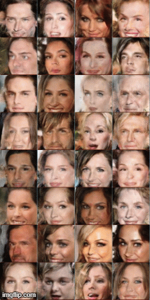

# [HoloGAN: Unsupervised Learning of 3D Representations From Natural Images](https://arxiv.org/abs/1904.01326)

Thu Nguyen-Phuoc, Chuan Li, Lucas Theis, Christian Richardt, Yong-Liang Yang

*International Conference on Computer Vision ICCV 2019*

****

This folder provides a re-implementation of this paper in PyTorch, developed as part of the course METU CENG 796 - Deep Generative Models. The re-implementation is provided by:

* Edanur Demir, e181920@metu.edu.tr

* Gökhan Özsarı, e211499@metu.edu.tr

Please see the jupyter notebook file [main.ipynb](main.ipynb) for a summary of paper, the implementation notes and our experimental results.


## Building the development environment:
Install Anaconda 3.7 from the website: https://www.anaconda.com/products/individual

Check cuda version if the Cuda is avaliable in the system so that we can work on GPU.
```markdown  
$ nvcc --version
nvcc: NVIDIA (R) Cuda compiler driver
Copyright (c) 2005-2018 NVIDIA Corporation
Built on Sat_Aug_25_21:08:04_Central_Daylight_Time_2018
Cuda compilation tools, release 10.0, V10.0.130
```
Check the website for proper installation command: https://pytorch.org/get-started/locally/. Below command is for a stable version of PyTorch on Linux. The conda installation is recommanded. According to the cuda version change the cudatoolkit version.


Create a new conda environment for HoloGAN:
```markdown  
$ conda create -n hologan python=3.7
```

Activate the hologan environment:
```markdown  
$ conda activate hologan
```

Install required libraries
```markdown  
$ conda install pytorch torchvision cpuonly -c pytorch
$ pip install scipy==1.1.0
$ conda install -c conda-forge matplotlib
```

In order to train
```markdown  
$ python main.py --batch-size 1 --max-epochs 100 --rotate-azimuth
```
