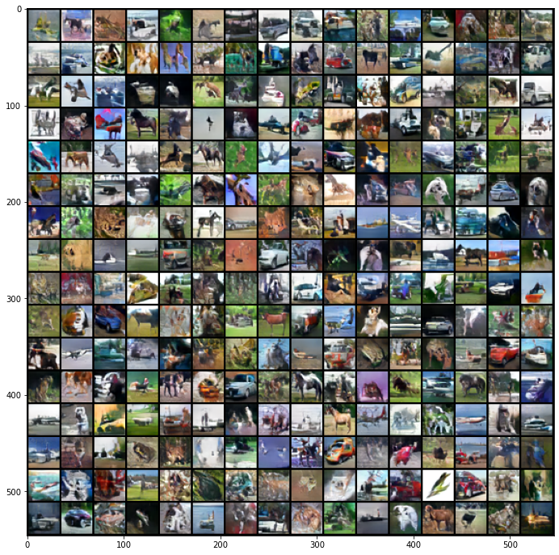
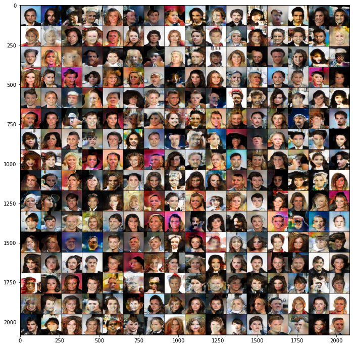

# [MSG-GAN: Multi-Scale Gradients for Generative Adversarial Networks](https://arxiv.org/pdf/1903.06048.pdf)


Animesh Karnewar and Oliver Wang


*CVPR 2020*




This folder provides a re-implementation of this paper in PyTorch, developed as part of the course METU CENG 796 - Deep Generative Models. The re-implementation is provided by:

* Deniz A. Acar, denizalperacar@gmail.com

* Yavuz Durmazkeser, yavuz.durmazkeser@metu.edu.tr


Please see the jupyter notebook file [main.ipynb](main.ipynb) for a summary of paper, the implementation notes and our experimental results.


**Solution to CelebA Download Error**: In case the code fails to download CelebA Dataset, download [this](https://drive.google.com/drive/folders/1hDQKv_NbYv2lk2sdBiVPQQivMWNSqTOC?usp=sharing) folder and place it under data/.


## Usage

Call the train.py from terminal to train the model in the following way:

```bash
$ python3 train.py --save_dir test/ --continue_checkpoint 1 --num_epochs 1 --lr 0.0001 --batch_size 16 --latent_dim 128 --num_blocks 4 --use_gpu 1 --n_disc 1 --dataset CIFAR10 --lamda 10.0
```
`--save_dir <saveDir>`  directory that the model is saved to. \
`--continue_checkpoint` loads the model in saveDir \
`--num_epochs 1`        num_epochs < 0 for convergence termination else terminates at num_epochs iterations \
`--lr 0.0001`           specify the learning rate for the optimizer \
`--batch_size 16`       specify the batch size for the training \
`--latent_dim 128`      specify the latent vector size of the model \
`--num_blocks 4`        specify the number of blocks to be used in the generator and discriminator. https://arxiv.org/pdf/1903.06048.pdf Table 6-7 \
`--use_gpu 1`           true to use GPU \
`--n_disc 1`            Number of discriminator optimization steps before one generator optimizer step \
`--dataset CIFAR10`     CIFAR10 to load Cifar 10 dataset CelebA to load CelebA dataset \
`--lamda 10.0`          WGAN-GP lambda value. \
