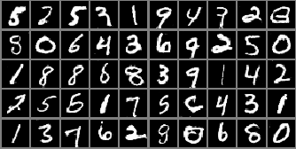

# [MarginGAN: Adversarial Training in Semi-Supervised Learning](https://papers.nips.cc/paper/9231-margingan-adversarial-training-in-semi-supervised-learning)

Jinhao Dong, Tong Lin

*NIPS 2019*

### Results

| Method      | Label Size: 100 | Label Size: 600 | Label Size: 1000 | Label Size: 3000 |
| ----------- | --------------- | --------------- | ---------------- | ---------------- |
| Our re-implementation |   4.19 ± 0.22   |   2.90 ± 0.32   |   2.92 ± 0.36    |   2.33 ± 0.13    |
| [MarginGAN](https://papers.nips.cc/paper/9231-margingan-adversarial-training-in-semi-supervised-learning.pdf)   |   3.53 ± 0.57   |   3.03 ± 0.60   |   2.87 ± 0.71    |   2.06 ± 0.20    |

Table 1: Mean and standard error rates of the classifier over 5 runs. Reproduction of Table 1 from [MarginGAN](https://papers.nips.cc/paper/9231-margingan-adversarial-training-in-semi-supervised-learning.pdf).

Fig. 1: Reproduction of Figure 3-a from [MarginGAN](https://papers.nips.cc/paper/9231-margingan-adversarial-training-in-semi-supervised-learning.pdf).

 This folder provides a re-implementation of this paper in PyTorch, developed as part of the course METU CENG 796 - Deep Generative Models. The re-implementation is provided by:

* Can Ufuk Ertenli, ufuk.ertenli@metu.edu.tr 

* Zeynep Sonat Baltacı, sonat.baltaci@metu.edu.tr

Please see the jupyter notebook file [main.ipynb](main.ipynb) for a summary of paper, the implementation notes and our experimental results.

### Requirements
Experiment are conducted with,
* Python 3.7.6
* PyTorch 1.5.0
* torchvision 0.6.0a0+82fd1c8
* Matplotlib 3.1.3

An additional [environment.yml](environment.yml) file is also provided.

### Additional Comments
Quantitative and qualitative results (Table 1 and Fig. 1) are obtained from the re-implementation of the preliminary study, conducted on [MNIST dataset](http://yann.lecun.com/exdb/mnist/).
