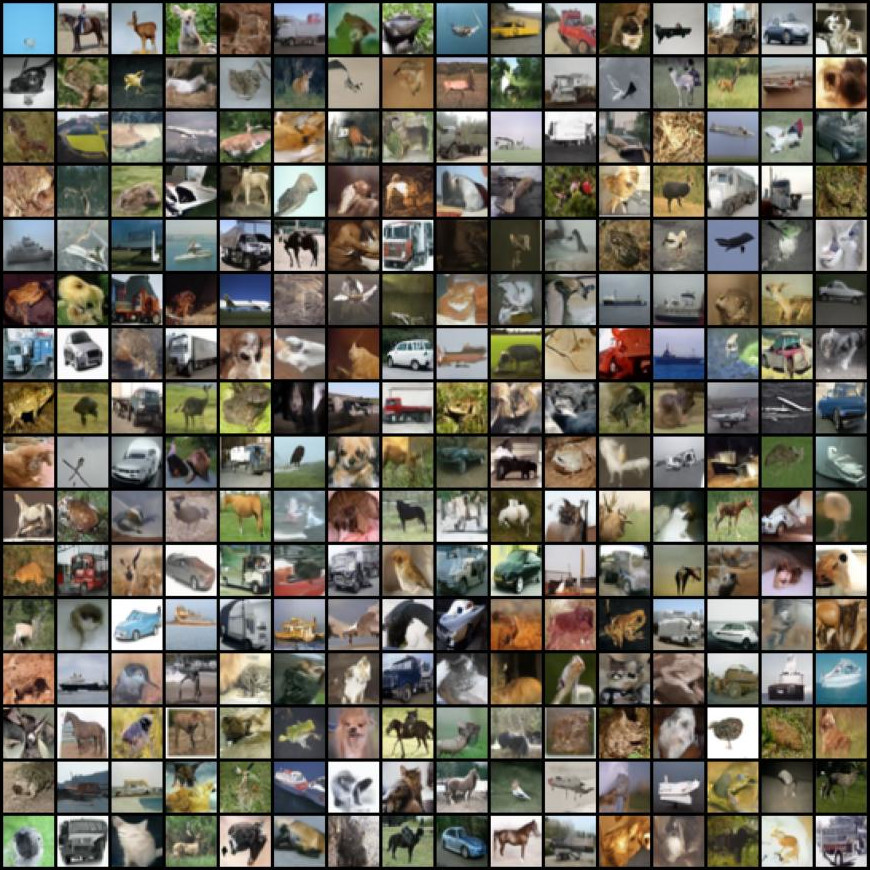

# [Improved Techniques for Training Score-BasedGenerative Models](https://arxiv.org/pdf/2006.09011.pdf)

Yang Song and Stefano Ermon

*NeurIPS 2020*

<p align="center">
  
</p>

This folder provides a re-implementation of this paper in PyTorch, developed as part of the course METU CENG 796 - Deep Generative Models. The re-implementation is provided by:

* Sezai Artun Ozyegin, artun.ozyegin@metu.edu.tr 
* Merve Tapli, merve.tapli@metu.edu.tr

Please see the jupyter notebook file [main.ipynb](main.ipynb) for a summary of paper, the implementation notes and our experimental results.

We calculate FID on both train and test sets of CIFAR10 and obtain the results that can be seen in the table below:

<center>

|  Results            |         FID               |
|:--------------------|:-------------------------:|
| NCSNv2 (Original)   |        10.87              |
| NCSNv2 (Ours)       |14.54 (Test), 12.53 (Train)|

</center>

## Requirements

This project is tested on Python 3.8.0. The packages we use:
```
torch==1.10.2
torchvision==0.11.3
numpy==1.22.3
scipy==1.5.3
matplotlib==3.5.1
tqdm
gdown
```

## Downloading the pretrained model and samples

Download the pretrained model:
```
bash download_data.sh
```

## Testing and training

To test and train, please follow the jupyter notebook file [main.ipynb](main.ipynb).
