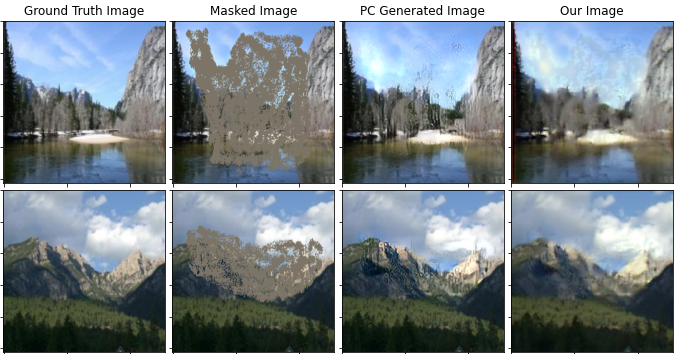

# PD-GAN: Probabilistic Diverse GAN for Image Inpainting 
#### (https://arxiv.org/abs/2105.02201)

Hongyu Liu, Ziyu Wan, Wei Huang, Yibing Song, Xintong Han, Jing Liao

*CVPR 2021*
   


This folder provides a re-implementation of this paper in PyTorch, developed as part of the course METU CENG 796 - Deep Generative Models. The re-implementation is provided by:
* Ali Ibrahim Ozkan, ozkan.ibrahim@metu.edu.tr
* Semih Soganci, e167996@metu.edu.tr

Please see the jupyter notebook file [main.ipynb](main.ipynb) for a summary of paper, the implementation notes and our experimental results.

### Usage 
#### Download Data
```
./download_data.sh
```

#### Steps for Preparing Data (Optional)

```
# Download Nvidia Mask Dataset
Download URL: https://www.dropbox.com/s/01dfayns9s0kevy/test_mask.zip?dl=0

# Classify Masks according to mask ratio -> util/lib/mask_generation/ 
python3 generate_mask.py 
        --output_mask_path ${OUTPUT MASK FOLDER} 
        --mask_folder_path ${Downloaded Mask Path} 
        --masked_ratio_lower_bound ${lower bound of mask ratio} 
        --masked_ratio_upper_bound ${upper bound of mask ratio}

# Download Pretrained PC Based Model
Download URL: https://github.com/naoto0804/pytorch-inpainting-with-partial-conv

# Create Mask, Ground Truth images and PC-Generated images dataset -> util/lib/pc_model_lib/
python3 test_pc_model.py 
        --model ${Downloaded Model Path} 
        --gt_folder_path ${Ground Truth Image Path} 
        --mask_folder_path ${Mask image Path} 
        --dest_folder_path ${Destination folder path to saving} 
        --is_random_mask_match_used ${Choose mask randomly or not} 
        --is_save_images ${Will generated images saved or not} 
        --is_show_image ${Will generated images showed or not}

```

#### Calculate FID (Optional)
```
# Calculate FID results -> metrics/
python3 fid.py 
        --fid_images_path ${Image path that contains generated and ground truth images} 
        --batch_size ${batch size of dataset} 
        --gt_suffix ${suffix of ground truth image}
        --gen_img_suffix ${suffix of generated image}
```

#### Acknowledgements
We would like to thank Hongyu Liu, Ziyu Wan, Wei Huang, Yibing Song, Xintong Han, Jing Liao for their work on this paper.

We would like to express our gratitude to Assistant Professor Gokberk Cinbis for giving the opportunity to implement this paper.
We would also like to extend our thanks to the our reviewer Orhun Bugra Baran for his constructive recommendations 
that have helped improving our fid results and fixing discriminator architecture, on this project.