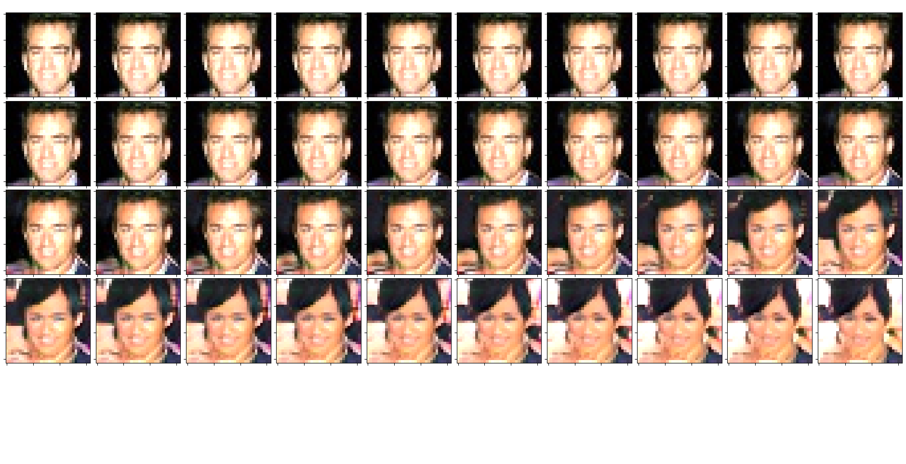
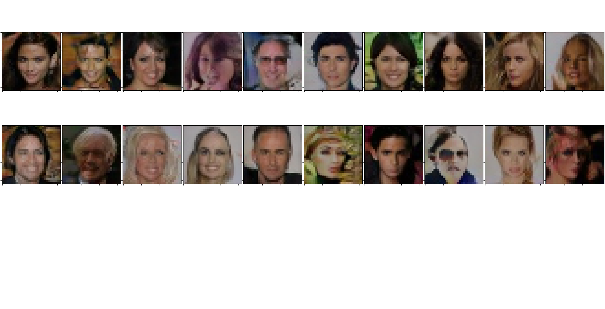

# [PROGRESSIVE GROWING OF GANS FOR IMPROVED QUALITY, STABILITY, AND VARIATION](https://arxiv.org/pdf/1710.10196.pdf)

Paper Tero Karras, Timo Aila, Samuli Laine, Jaakko Lehtinen

*ICLR 2018*

This folder provides a re-implementation of this paper in PyTorch, developed as part of the course METU CENG 796 - Deep Generative Models. The re-implementation is provided by:

* Deniz A. ACAR, e178700@metu.edu.tr 

* Selçuk SEZER, selcuk.sezer@metu.edu.tr

Please see the jupyter notebook file [main.ipynb](main.ipynb) for a summary of paper, the implementation notes and our experimental results.

Using the code is very easy.

Just make sure that your current directory is ProGan/

there you can use:

$python src/train.py

to start the training.

If you want to change the hyper-parameters of the network you can change them the config dictionary in train.py.

If the code will be used from jupyter you might add the following to the top of your code:

import os

import sys

sys.path.insert(0, os.path.abspath('{}/src/'.format(os.getcwd())))

then import the generator and discriminator from their corresponding files.

You can access the dataset here:

https://drive.google.com/file/d/1f98t8iv7YZLk2sTBCsDqfiuV_NJVF4CI/view?usp=sharing

Please dont forget to add the local directory of the dataset in config in train.py

