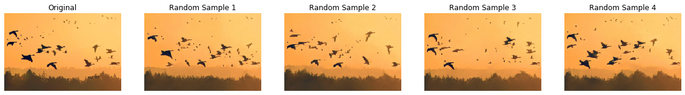

# [SinGAN: Learning a Generative Model from a Single Natural Image](http://openaccess.thecvf.com/content_ICCV_2019/papers/Shaham_SinGAN_Learning_a_Generative_Model_From_a_Single_Natural_Image_ICCV_2019_paper.pdf)

Tamar Rott Shaham, Tali Dekel, Tomer Michaeli

ICCV 2019




This folder provides a re-implementation of this paper in PyTorch, developed as part of the course METU CENG 796 - Deep Generative Models. The re-implementation is provided by:

Ataberk Dönmez, ataberk.donmez@metu.edu.tr <br>
Deniz Sayın, sayin.deniz@metu.edu.tr

Please see the jupyter notebook file [main.ipynb](main.ipynb) for a summary of paper, the implementation notes and our experimental results. The notebook is best viewed using Jupyter rather than github's own viewer.

The required packages can be found in requirements.txt and installed with conda as follows (tested on Python 3.6): <br>
```
conda install --file requirements.txt -c conda-forge
```
