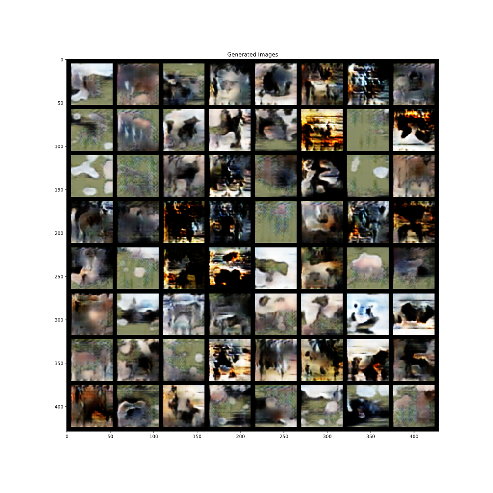
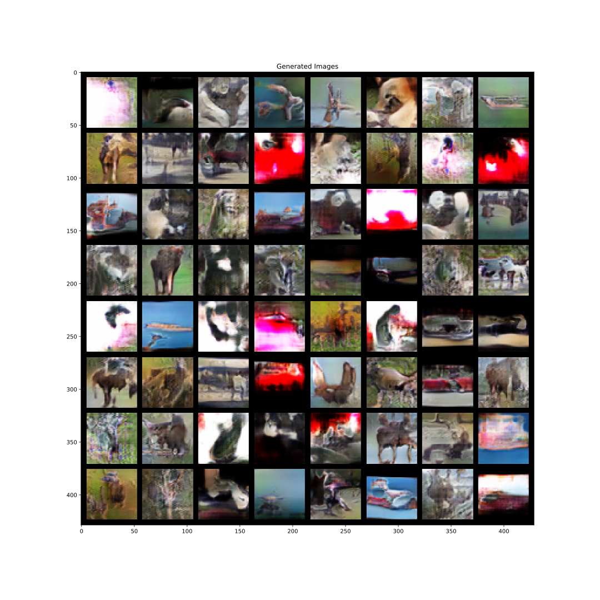

# [Sphere Generative Adversarial Network Based on Geometric Moment Matching](http://openaccess.thecvf.com/content_CVPR_2019/papers/Park_Sphere_Generative_Adversarial_Network_Based_on_Geometric_Moment_Matching_CVPR_2019_paper.pdf)

Sung Woo Park and Junseok Kwon

*CVPR 2019*

    
    

This folder provides a re-implementation of this paper in PyTorch, developed as part of the course METU CENG 796 - Deep Generative Models. The re-implementation is provided by:

* Ismail Hakki Kocdemir, e203605@metu.edu.tr 

* Hazan Anayurt, e209874@metu.edu.tr

Please see the jupyter notebook file [main.ipynb](main.ipynb) for a summary of paper, the implementation notes and our experimental results.

## Usage

1. Download the data using 'python3 download_data.py'
2. Run 'main.ipynb'

