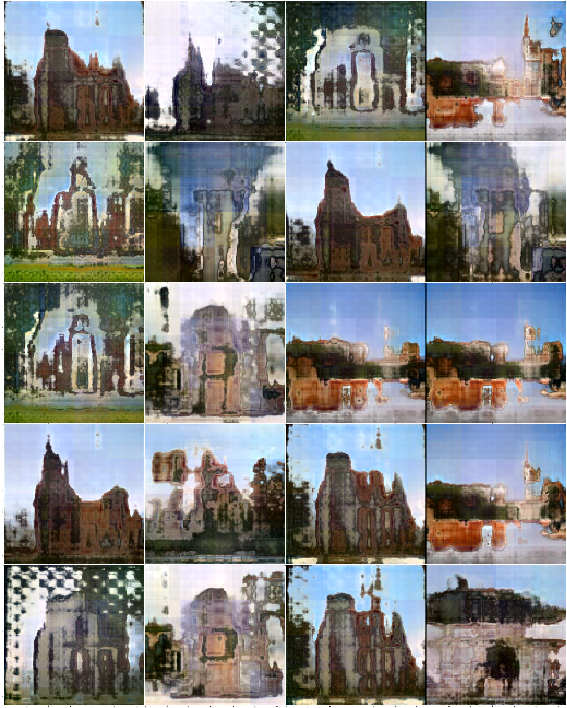

# [StyleSwin: CVPR 2022 Transformer Based GAN Paper Implementation](https://arxiv.org/pdf/2112.10762.pdf)

 Bowen Zhang, Shuyang Gu, Bo Zhang, Jianmin Bao, Dong Chen, Fang Wen, Yong Wang, Baining Guo
 
 CVPR 2022
 

This folder provides a re-implementation of this paper in PyTorch, developed as part of the course METU CENG 796 - Deep Generative Models. The re-implementation is provided by:
* Alpay Özkan, alpay.ozkan@metu.edu.tr 
* Hıdır Yeşiltepe, hidir.yesiltepe@metu.edu.tr

We have already trained several models and we have saved the best ones in the following drive directory where there are 2 models: one for LSUN and one for CELEBA. https://drive.google.com/drive/folders/1MlT53Woi5pRLNGUBG0Pfvx9ximXxCojR?usp=sharing You can also load your own trained model by setting the correct path for the model.

Please see the jupyter notebook file [main.ipynb](main_demos.ipynb) for a summary of paper, the implementation notes and our experimental results.
