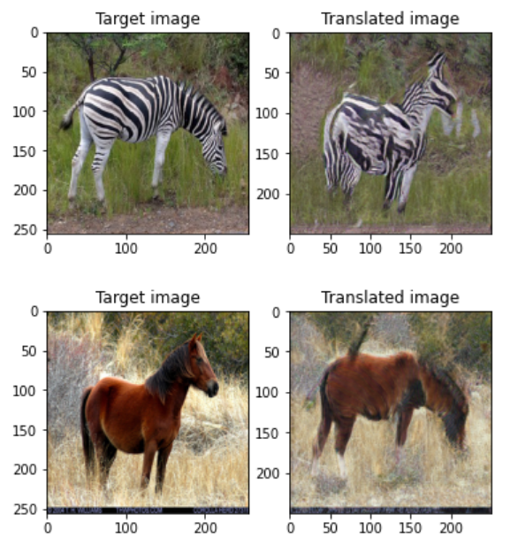

# [TuiGAN: Learning Versatile Image-to-Image Translation with Two Unpaired Images](https://arxiv.org/abs/2004.04634) 

Jianxin Lin, Yingxue Pang, Yingce Xia, Zhibo Chen, Jiebo Luo

*ECCV 2020 Spotlight*

This folder provides a re-implementation of this paper in PyTorch, developed as part of the course METU CENG 796 - Deep Generative Models. The re-implementation is provided by:

* Bedirhan Uğuz, bedirhan.uguz@metu.edu.tr
* Özhan Suat, ozhan.suat@metu.edu.tr

Please see the jupyter notebook file [main.ipynb](main.ipynb) for a summary of paper, the implementation notes and our experimental results.