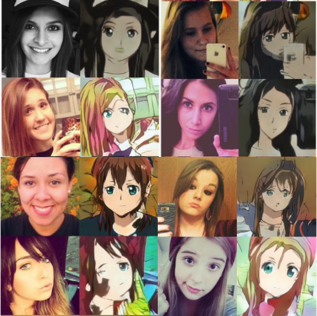

## U-GAT-IT &mdash; Unofficial PyTorch Implementation
### [Unsupervised Generative Attentional Networks with Adaptive Layer-Instance Normalization for Image-to-Image Translation](https://arxiv.org/abs/1907.10830)

**Authors**: Junho Kim, Minjae Kim, Hyeonwoo Kang, Kwanghee Lee.

**ICLR 2020**

<div align="center">
  
</div>

This folder provides a re-implementation of this paper in PyTorch, developed as part of the course METU CENG 796 - Deep Generative Models. The re-implementation is provided by:

* Onur Can Üner, onur.uner@metu.edu.tr 

* Sinan Gençoğlu, sinan.gencoglu@metu.edu.tr

Please see the jupyter notebook file [main.ipynb](main.ipynb) for a summary of paper, the implementation notes and our experimental results.

## Dataset

You can download the dataset using following bash command or using the link below. It will create directory: data/selfie2anime/..

```
sh scripts/download_data.sh
```
[Dataset](https://drive.google.com/file/d/1xOWj1UVgp6NKMT3HbPhBbtq2A4EDkghF/view)


## Training

After downloading the dataset you can train your own model using command:

```
python main --config ./config/selfie2anime
```

You can make lots of changes using config json file. 

## Testing

If you want to test model with pre-trained weights:

```
sh scripts/download_checkpoint.sh
```
[Log files and Checkpoint](https://drive.google.com/file/d/12rsi3jNxflYBiyctn6ipNu2Tdh2WA_SZ/view)

Import neccessary libraries
```python
import json
import numpy as np
import matplotlib.pyplot as plt
from easydict import EasyDict as edict

import torch
import torchvision
from torchvision.utils import make_grid

import lib.models as models
import lib.data as datasets
from lib.utils import code_backup, load_checkpoint
```

Load the config file and model.

```python
config = edict(json.load(open('configs/selfie2anime.json')))
device = torch.device("cuda" if torch.cuda.is_available() else "cpu")

# Load model
checkpoint = './saved/UGATIT_selfie2anime/05-30_00-05/checkpoints/checkpoint-epoch42.pth'
model = getattr(models, config.arch.type)(**config.arch.args)
checkpoint = load_checkpoint(checkpoint)
model.load_pretrained_weights(checkpoint['state_dict'])
del checkpoint
model.to(device)
model.eval()
```

Create validation(test) set

```python
val_set = getattr(datasets, config.datamanager.type)(
        config.datamanager.root, config.datamanager.dataset_dir,
        width=config.datamanager.width,
        height=config.datamanager.height,
        mean=config.datamanager.norm_mean,
        std=config.datamanager.norm_std,
        mode="test")
```

You can get sample images using G_AB generator:

```python
images = []
for i, data in enumerate(val_set):
    if i == 10:
        break
    real_A = data['A'].to(device).unsqueeze(0)
    real_B = data['B'].to(device).unsqueeze(0)

    _, fake_B = model.forward(real_A, real_B)
    
    real_A = val_set.denormalize(real_A, device=device)
    fake_B = val_set.denormalize(fake_B, device=device)

    images.append(torch.cat((real_A.cpu().detach(), fake_B.cpu().detach()), dim=-1))
    
images = torch.cat(images, dim=-2)
images = make_grid(images, padding=100).numpy()
plt.figure(figsize = (128, 64))
plt.axis('off')
plt.imshow(np.transpose(images, (1,2,0)), interpolation='nearest')

```

