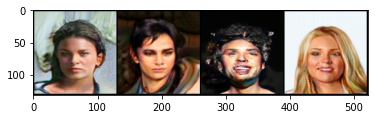

# [A U-Net Based Discriminator for Generative Adversarial Networks](https://arxiv.org/pdf/2002.12655.pdf)

Edgar Schonfeld, Bernt Schiele, Anna Khoreva

*CVPR 2020*

This folder provides a re-implementation of this paper in PyTorch, developed as part of the course METU CENG 796 - Deep Generative Models. The re-implementation is provided by:

* Cagri Eser, cagri.eser@metu.edu.tr

* Yasar Cahit Yildirim, cahit.yildirim@metu.edu.tr

Please see the jupyter notebook file [main.ipynb](main.ipynb) for a summary of the paper, the implementation notes and our experimental results.

----

The required Python modules are in `requirements.txt` (also in `requirements_informal.txt`, but that is not parsable).

The experiments expect the CelebA dataset to be under `celeba/` here, and will download it under that repository if it is not found.

Our pre-trained models are offloaded in order to shrink the repository size. See `unetgan/models/README.md` for a download link of a pretrained model.
